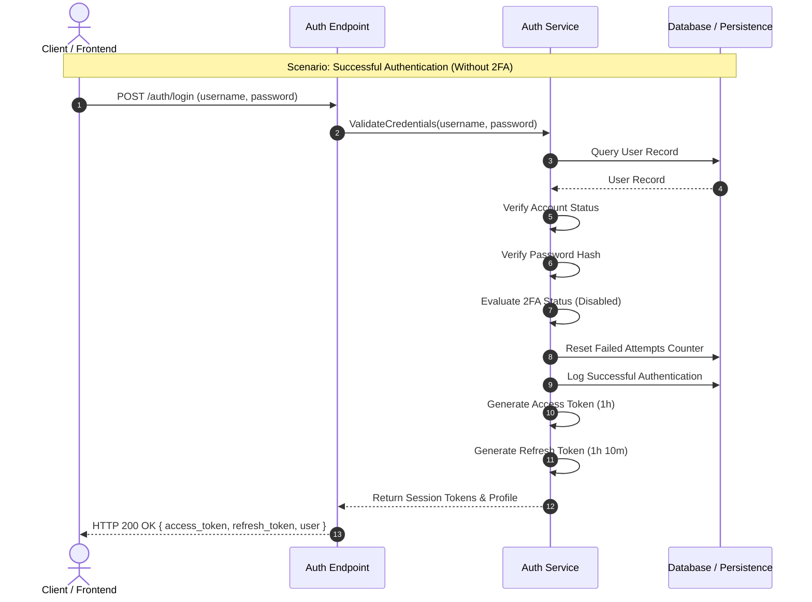
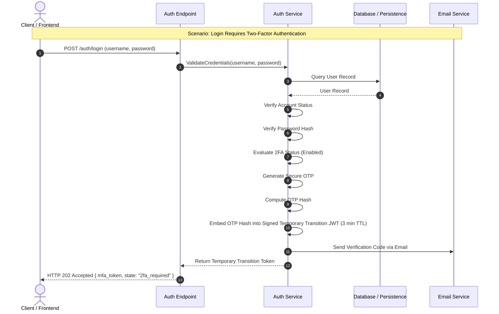
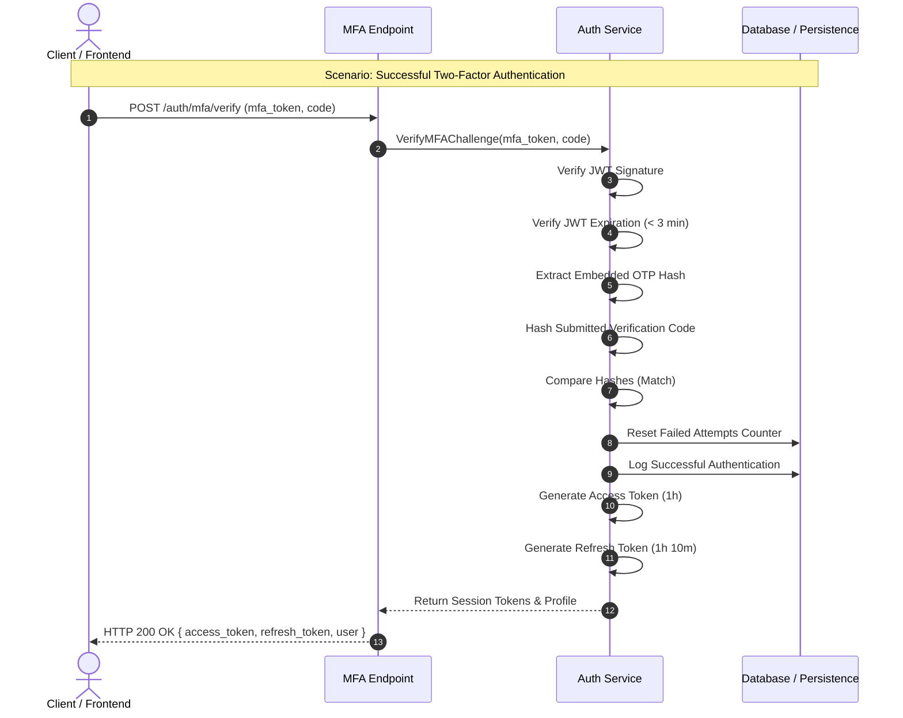

# Authentication Flow

**Last Updated:** July 18, 2026  
**Author:** Ismael Romero

---

# Introduction

Authentication represents the entry point to every protected resource within the Cakelet
platform. Because authentication is responsible for establishing the user's identity,
all subsequent authorization decisions depend on the correctness of this process.

The authentication subsystem has been designed following a security-first approach.
Rather than limiting itself to credential verification, it incorporates multiple
validation stages intended to mitigate common attack vectors including user enumeration,
brute-force attacks, credential stuffing, replay attempts, and unauthorized access to
locked or suspended accounts.

Authentication is implemented as a two-phase workflow.

The first phase validates the user's credentials and determines whether an additional
authentication factor is required. If Two-Factor Authentication (2FA) is disabled, the
authentication process completes immediately by issuing the definitive session tokens.

When 2FA is enabled, however, authentication temporarily transitions into a pending
state. Instead of creating a session, the server generates a short-lived,
cryptographically signed **Temporary Transition Token (JWT)** together with a one-time
verification code (OTP). The OTP is delivered to the user's registered email address,
while **only the cryptographic hash of the OTP is embedded inside the JWT**.

This design makes the MFA flow completely **stateless**. No temporary authentication
state, verification codes, or pending login sessions are stored in the database. During
the second authentication phase, the submitted verification code is hashed and compared
against the hash contained within the signed Temporary Transition Token.

---

# Primary Authentication Flow

The authentication process begins when the client submits the user's credentials to the
authentication endpoint.

Upon receiving the request, the Authentication Service retrieves the corresponding user
record from the persistence layer and performs a sequence of security validations.

The first validation determines whether the supplied identifier exists in the system.
Whenever no matching account is found, the authentication process is immediately
terminated. A failed authentication event is recorded while a generic authentication
error is returned to the client. This behavior intentionally prevents user enumeration
by avoiding any indication of whether a particular account exists.

If the account exists, the service evaluates whether authentication is currently
permitted.

Two independent lock mechanisms are verified:

- Temporary account lock caused by excessive authentication failures.
- Administrative account suspension.

Whenever either condition is satisfied, authentication is rejected, the event is logged,
and a generic account-locked response is returned.

Only after these validations succeed does the Authentication Service verify the user's
password. The submitted password is processed using the configured password hashing
algorithm and compared against the stored password hash.

Authentication failures increment the user's failed-attempt counter. Once the configured
threshold is exceeded, the account is automatically transitioned into a temporary locked
state.

After successful credential validation, the Authentication Service determines whether
Two-Factor Authentication has been enabled.

If 2FA is disabled, authentication completes immediately by:

- Resetting the failed-attempt counter.
- Recording a successful authentication event.
- Retrieving the user's profile.
- Generating the definitive Access Token and Refresh Token.
- Returning the authenticated session.

When 2FA is enabled, authentication intentionally pauses before establishing a session.

The Authentication Service performs the following operations:

1. Generates a cryptographically secure One-Time Password (OTP).
2. Computes a cryptographic hash of the OTP.
3. Embeds the OTP hash inside a signed Temporary Transition Token (JWT) with a maximum
   lifetime of three minutes.
4. Sends the plaintext OTP to the user's registered email address.
5. Returns the Temporary Transition Token to the client.

Because the OTP hash is embedded inside the signed JWT, the server does **not** persist
the verification code, pending authentication state, or temporary login session. The MFA
challenge is therefore completely stateless.

> **Note**
>
> The following sequence diagrams illustrate only the successful authentication paths.
> Failure scenarios such as invalid credentials, locked accounts, expired tokens, or
> invalid verification codes are omitted for clarity.

---

## Successful Authentication (Without 2FA)

---

## Initial Authentication (2FA Enabled)

---

# Two-Factor Authentication Flow

The second authentication phase begins after the user receives the verification code by
email.

The client submits both the verification code and the Temporary Transition Token to the
dedicated MFA verification endpoint.

The Authentication Service first validates the Temporary Transition Token by verifying
its cryptographic signature and expiration time.

Tokens with invalid signatures or expired lifetimes are immediately rejected without any
additional processing.

If the token is valid, the Authentication Service extracts the embedded OTP hash from the
JWT payload.

The verification code submitted by the client is hashed using the same hashing algorithm
employed during the primary authentication phase. The resulting hash is then compared
against the hash contained within the signed Temporary Transition Token.

Because the hash is protected by the JWT signature, any modification of the embedded
value invalidates the token, eliminating the need to persist temporary authentication
state in the database.

Successful verification completes the authentication workflow.

The Authentication Service then:

- Resets the failed-attempt counter.
- Records a successful authentication event.
- Retrieves the user's profile.
- Generates the definitive Access Token.
- Generates the definitive Refresh Token.
- Returns the authenticated session.

Failed verification attempts are treated as authentication failures.

Each unsuccessful verification:

- Records a failed authentication event.
- Increments the user's failed-attempt counter.
- Locks the account once the configured threshold is exceeded.

The client receives an error indicating whether the verification code is invalid or the
Temporary Transition Token has expired.

---

## Successful Two-Factor Authentication

---

# Security Considerations

The authentication workflow incorporates multiple security controls designed to minimize
the platform's attack surface.

- Generic authentication responses prevent user enumeration.
- All authentication events are centrally logged.
- Failed authentication attempts increment a lockout counter.
- Automatic account locking mitigates brute-force attacks.
- Administrative account suspension immediately revokes access.
- Passwords are never compared in plaintext.
- Password verification relies exclusively on secure password hashing algorithms.
- The MFA workflow is completely stateless and requires no temporary database storage.
- Verification codes are never embedded inside tokens; only their cryptographic hashes
  are included.
- Temporary Transition Tokens are cryptographically signed and expire after three
  minutes.
- Any modification of the embedded OTP hash invalidates the JWT signature.
- Definitive session tokens are issued only after every authentication requirement has
  been successfully satisfied.
- Failed-attempt counters are reset only after the entire authentication workflow,
  including MFA when enabled, completes successfully.