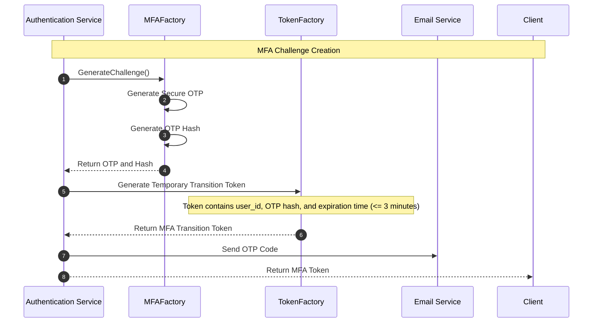
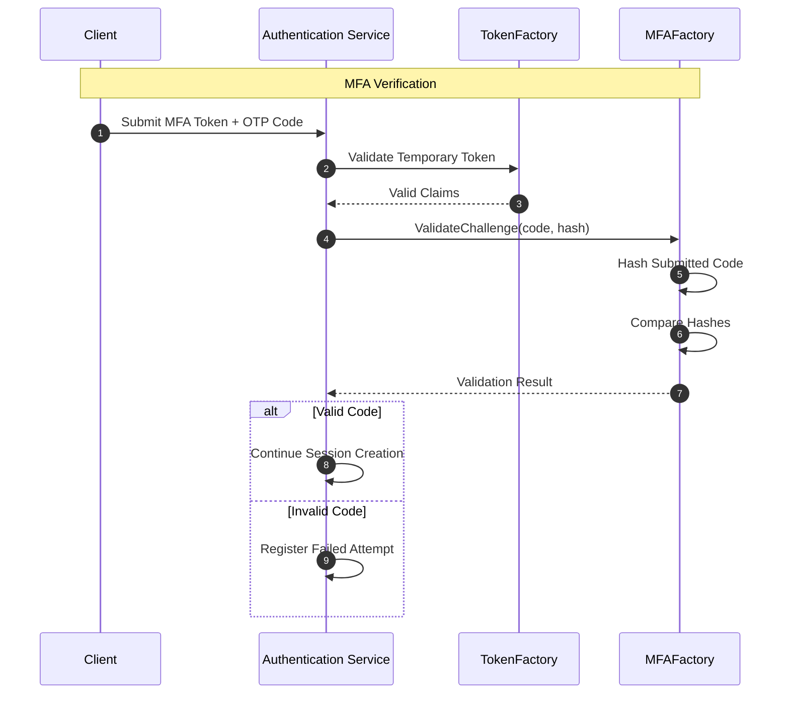

# MFAFactory Security Component Specification

**Last Updated:** July 18, 2026  
**Author:** Ismael Romero

---

# 1. Introduction & Responsibility

The `MFAFactory` is a core security component responsible for generating and validating
Multi-Factor Authentication (MFA) challenges within the authentication subsystem.

Its primary responsibility is to provide a secure mechanism for creating temporary
verification challenges and validating user-provided verification codes before allowing
the establishment of an authenticated session.

The component abstracts the cryptographic operations required by the MFA workflow,
including:

- Secure one-time code generation.
- Verification code hashing.
- Challenge validation.
- Protection against replay and unauthorized verification attempts.

The `MFAFactory` does not manage:

- User accounts.
- Authentication sessions.
- Email delivery.
- Token lifecycle.
- Persistence operations.
- Authorization decisions.

Its responsibility is limited to the cryptographic processing of MFA challenges.

The architectural boundary can be summarized as follows:

```text
Authentication Service
          |
          |
          v
      MFAFactory
          |
          |
          v
 Secure MFA Challenge Validation
```

The component completes its responsibility once the MFA challenge has been generated
or validated.

---

# 2. Design & Architecture

The `MFAFactory` follows the same security architecture principles used throughout the
authentication subsystem.

The component is designed to be:

- Stateless.
- Cryptographically isolated.
- Independently testable.
- Decoupled from authentication workflows.

---

# 2.1 Interface-Based Abstraction

The component exposes the `MFAFactory` interface as its public contract.

This abstraction provides:

- Separation between MFA logic and authentication services.
- Easier unit testing through mocks.
- Ability to replace the underlying MFA implementation without affecting consumers.

Example:

```go
type MFAFactory interface {
    GenerateChallenge() (*MFAChallenge, error)
    ValidateChallenge(code string, challengeHash string) (bool, error)
}
```

Authentication services depend on the interface instead of the concrete implementation.

---

# 2.2 Dependency Injection

The component is designed to integrate with Uber Fx through constructor injection.

Example:

```go
type MFAFactoryParams struct {
    fx.In

    Config Config
}
```

Injected configuration may include:

- OTP length.
- Hashing configuration.
- Challenge expiration policy.
- Random generator configuration.

The component must never receive user information or persistence dependencies.

---

# 3. MFA Challenge Architecture

The MFA workflow uses short-lived verification challenges instead of persistent OTP
storage.

The generated verification code is never stored or transmitted in plaintext by the
backend.

The challenge lifecycle follows:

```text
Generate OTP
      |
      |
      v
Hash OTP
      |
      |
      v
Embed Hash into Temporary Token
      |
      |
      v
User submits OTP
      |
      |
      v
Compare Generated Hash
```

This approach prevents exposure of active MFA codes through:

- Database leaks.
- Logs.
- Debug traces.
- Unauthorized persistence access.

---

# 4. MFA Challenge Structure

The MFA challenge contains the information required to validate a second factor.

Example:

```go
type MFAChallenge struct {
    CodeHash string
    ExpiresAt time.Time
}
```

The plaintext verification code exists only during generation and delivery.

The stored representation contains only:

- Hashed verification code.
- Expiration metadata.

---

# 5. Public API

The `MFAFactory` exposes two main operations:

- Challenge generation.
- Challenge validation.

---

# 5.1 GenerateChallenge

## Signature

```go
GenerateChallenge() (*MFAChallenge, error)
```

## Description

Generates a cryptographically secure one-time verification challenge.

The operation performs:

1. Generate a random numeric verification code.
2. Hash the generated code.
3. Create the MFA challenge representation.
4. Return the plaintext code for delivery and the protected hash representation.

Example:

```text
Generated OTP:

482913


Stored Representation:

$2b$12$8s91...
```

---

## Security Requirements

The generated code must:

- Use a cryptographically secure random generator.
- Have sufficient entropy.
- Never be predictable.
- Never be reused.

Example policy:

```text
OTP Length:
6 digits

Lifetime:
3 minutes
```

---

# 5.2 ValidateChallenge

## Signature

```go
ValidateChallenge(
    code string,
    challengeHash string
) (bool, error)
```

## Description

Validates whether a user-provided MFA code matches the previously generated challenge.

The operation performs:

1. Receive the user-provided code.
2. Apply the same hashing strategy.
3. Compare the generated hash against the stored challenge hash.
4. Return the validation result.

---

## Output

Successful validation:

```text
true
```

Invalid verification code:

```text
false
```

Internal processing failures:

```text
error
```

---

# 6. Authentication Flow Integration

The `MFAFactory` is invoked during the authentication process only after the primary
credentials have been validated.

It participates in two stages:

1. MFA challenge generation.
2. MFA challenge validation.

---

# 6.1 MFA Challenge Generation Flow



---

# 6.2 MFA Verification Flow



---

# 7. Security Requirements

## 7.1 OTP Protection

Verification codes must:

- Never be stored in plaintext.
- Never appear in logs.
- Never be returned through API responses.
- Never be reused.
- Have a limited lifetime.

---

## 7.2 Replay Protection

Each MFA challenge must be:

- Short-lived.
- Associated with a single authentication attempt.
- Invalid after successful verification.

A previously consumed challenge must not allow session creation.

---

## 7.3 Secure Random Generation

OTP values must be generated using cryptographically secure randomness.

The implementation must not use:

- Pseudo-random generators.
- Predictable sequences.
- Timestamp-based generation.

---

## 7.4 Timing Attack Resistance

Verification comparisons must use constant-time comparison mechanisms whenever possible.

The implementation must avoid exposing information about:

- Hash length.
- Matching characters.
- Partial validation results.

---

# 8. Error Handling

Errors generated by the `MFAFactory` follow the security module convention:

```text
security/factory:
```

---

## Error Definitions

| Error | Description |
|---|---|
| `ErrInvalidChallenge` | Returned when the MFA challenge cannot be validated. |
| `ErrExpiredChallenge` | Returned when the challenge exceeds its validity period. |
| `ErrCodeMismatch` | Returned when the provided code does not match the generated challenge. |
| `ErrChallengeGeneration` | Returned when secure OTP generation fails. |
| `ErrHashGeneration` | Returned when the OTP hash operation fails. |

---

# 9. Uber Fx Integration

The component is registered within the security module.

Example:

```go
// security/module.go

var Module = fx.Options(
    fx.Provide(
        factory.NewPasswordFactory,
        factory.NewTokenFactory,
        factory.NewMFAFactory,
    ),
)
```

Once registered, authentication services can receive the `MFAFactory` dependency
through constructor injection.

---

# 10. Design Principles Summary

The `MFAFactory` follows these architectural principles:

- **Single Responsibility:** Handles MFA challenge generation and validation only.
- **Stateless Operation:** Does not persist MFA state or user information.
- **Cryptographic Isolation:** Encapsulates OTP protection mechanisms.
- **Secure Challenge Lifecycle:** Uses short-lived verification challenges.
- **Replay Resistance:** Prevents reuse of previously issued MFA codes.
- **Authentication Separation:** Does not create sessions or manage user identity.
- **Testability:** Provides an interface-based abstraction suitable for isolated testing.