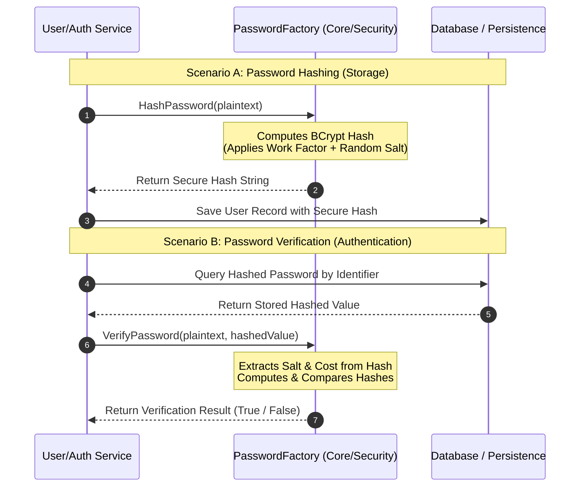

# PasswordFactory Security Component Specification

**Last Updated:** July 18, 2026  
**Author:** Ismael Romero

---

# 1. Introduction & Responsibility

The `PasswordFactory` is a core component within the security subsystem responsible for
password hashing and verification operations. Its primary purpose is to isolate
cryptographic concerns related to user credentials from authentication workflows,
persistence management, and user lifecycle operations.

Following the Single Responsibility Principle (SRP), the component has a single reason
to change: modifications to password protection and verification mechanisms. The
`PasswordFactory` does not manage users, authentication sessions, persistence, or
authorization rules. Instead, it provides a controlled abstraction for transforming
plaintext passwords into secure password hashes and validating password credentials
against previously generated hashes.

The component is intentionally designed to be stateless. It does not persist, cache,
store, or manage passwords or user information. Each operation receives the required
input data, performs the cryptographic computation, and returns the resulting output.

The architectural boundary can be summarized as follows:

```text
User/Auth Service
        |
        |
        v
PasswordFactory
        |
        |
        v
Cryptographic Hash Result
```

The responsibility of the component ends once the cryptographic operation has been
completed.

---

# 2. Cryptographic Architecture

To protect user credentials against database exposure, brute-force attempts, credential
stuffing attacks, and precomputed hash attacks, the `PasswordFactory` uses an adaptive
password hashing algorithm.

## 2.1 Cryptographic Algorithm

The component utilizes **BCrypt**, an adaptive password hashing algorithm based on the
EksBlowfish key schedule derived from the Blowfish cipher.

Unlike general-purpose cryptographic hash functions, BCrypt is specifically designed
for password storage. Its computational cost can be increased over time, allowing
systems to adapt as hardware capabilities improve.

BCrypt provides the following security properties:

- Computationally expensive hashing.
- Built-in random salt generation.
- Configurable work factor.
- Resistance against rainbow-table and precomputation attacks.

---

# 2.2 Salt Management

BCrypt automatically generates a unique random salt for every hashing operation.

As a result, identical passwords generate different hash outputs:

```text
Password:
SecurePassword123

Generated Hash #1:
$2b$12$L8q...

Generated Hash #2:
$2b$12$M7x...
```

This prevents attackers from using precomputed hash databases to identify passwords.

The salt is stored as part of the BCrypt encoded hash and does not need to be stored
separately.

---

# 2.3 Work Factor Configuration

BCrypt execution time is controlled through a configurable work factor (cost).

The selected value must be determined through environment-specific performance
benchmarks and periodically reviewed as hardware capabilities evolve.

Example:

```text
Cost 10:
Suitable for legacy environments

Cost 12+:
Common choice for modern production systems
```

The work factor represents a balance between:

- Authentication latency.
- Server resource consumption.
- Resistance against brute-force attacks.

The configured value should be high enough to slow attackers while maintaining
acceptable application performance.

---

# 3. Component Interface

The public API exposes two primary operations:

- Password hashing.
- Password verification.

The component does not perform password policy validation.

Rules such as:

- Minimum password length.
- Complexity requirements.
- Password history.
- User-specific restrictions.

must be handled by higher-level application services.

---

# 3.1 HashPassword

## Signature

```text
HashPassword(plaintext string) (string, error)
```

## Description

Receives a plaintext password and generates a BCrypt password hash suitable for secure
storage.

The operation performs:

1. Validation of the hashing request.
2. BCrypt hash generation.
3. Salt generation.
4. Work factor application.
5. Secure hash generation.

## Input

```text
plaintext
```

The original password provided during:

- User registration.
- Password update.
- Password recovery flows.

The value must never be logged, persisted, or exposed through diagnostic systems.

## Output

A BCrypt-compatible encoded hash.

Example:

```text
$2b$12$N9qo8uLOickgx2ZMRZoMye...
```

or an error if the hashing operation cannot be completed.

---

# 3.2 VerifyPassword

## Signature

```text
VerifyPassword(
    plaintext string,
    hashedValue string
) (bool, error)
```

## Description

Validates whether a plaintext password matches an existing BCrypt hash.

BCrypt internally extracts:

- Algorithm identifier.
- Work factor.
- Salt value.

The component then performs the verification process using the same parameters.

## Input

### plaintext

The password submitted during authentication.

### hashedValue

The previously stored BCrypt hash retrieved from persistence.

## Output

The operation returns:

```text
true
```

when the password matches.

```text
false
```

when the password does not match.

An error is returned only when the verification process cannot be executed correctly,
for example:

- Invalid hash format.
- Corrupted stored value.
- Unsupported cryptographic configuration.

---

# 4. Architectural Integration Flow

The `PasswordFactory` is invoked by higher-level identity services.

It remains isolated from authentication decisions and persistence responsibilities.



---

# 5. Security Requirements

## 5.1 Plaintext Password Protection

Plaintext passwords must never:

- Be logged.
- Be persisted.
- Be cached.
- Appear in application traces.
- Be included in monitoring payloads.

The implementation should minimize the lifetime of plaintext credentials in memory
whenever the runtime environment allows explicit memory management.

Managed-runtime environments such as Java, Go, and C# may not provide deterministic
memory clearing due to garbage collection behavior.

---

# 5.2 Irreversible Password Storage

BCrypt produces computationally irreversible password hashes.

There is no:

- Decryption key.
- Recovery mechanism.
- Mathematical reverse operation.

capable of recovering the original password from the stored hash.

Password verification is performed by hashing the provided password and comparing the
result against the stored BCrypt representation.

---

# 5.3 Error Handling and Information Disclosure

The component must distinguish between authentication failures and internal failures.

Expected credential mismatch:

```text
Password does not match
        |
        v
Return false
```

Internal failures:

```text
Invalid hash format
Cryptographic failure
Unsupported configuration
        |
        v
Return error
```

Authentication layers should avoid exposing sensitive internal details to clients.

The application layer is responsible for converting internal errors into appropriate
external responses.

---

# 6. Design Principles Summary

The `PasswordFactory` follows these architectural principles:

- **Single Responsibility:** Only manages password hashing and verification.
- **Stateless Design:** Does not store authentication state or user information.
- **Cryptographic Isolation:** Encapsulates password protection mechanisms.
- **Adaptive Security:** Supports increasing computational cost over time.
- **Secure Boundaries:** Prevents authentication logic from depending directly on
  cryptographic implementation details.
