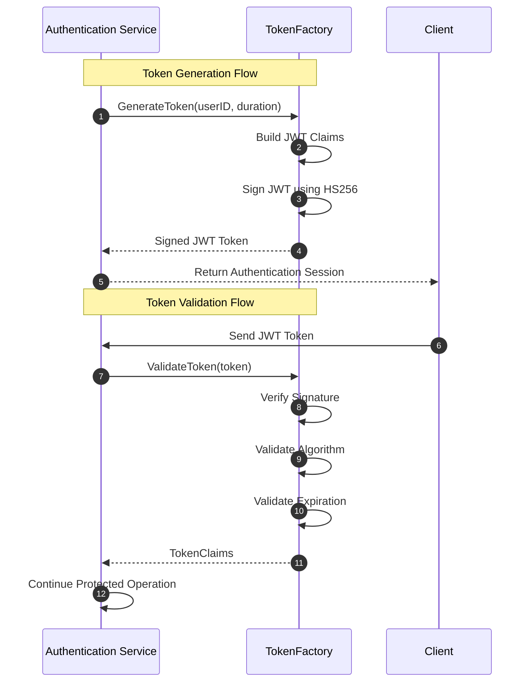

# TokenFactory Security Component Specification

**Last Updated:** July 18, 2026  
**Author:** Ismael Romero

---

# 1. Introduction & Responsibility

The `TokenFactory` is a core component within the authentication subsystem responsible
for the generation, signing, and validation of JSON Web Tokens (JWT).

Its primary purpose is to provide a secure and standardized mechanism for managing
authenticated sessions and user identities across the platform, while abstracting
cryptographic implementation details from higher-level application services.

The component establishes a clear security boundary between authentication workflows
and token management responsibilities. It does not handle user authentication,
authorization decisions, persistence operations, or session lifecycle management.
Instead, it provides a controlled interface for creating and validating cryptographic
tokens.

The architectural responsibility can be summarized as follows:

```text
Authentication Service
          |
          |
          v
     TokenFactory
          |
          |
          v
 Signed JWT Tokens
```

The responsibility of the component ends once the token has been generated or validated.

---

# 2. Design & Architecture

The `TokenFactory` follows the architectural standards defined by the Uber Go Style
Guide and is designed to integrate with the Uber Fx dependency injection framework.

The component follows these principles:

---

## 2.1 Interface-Based Abstraction

The component exposes the `TokenFactory` interface as its public contract.

This abstraction provides:

- Decoupling between consumers and implementation details.
- Easier unit testing through mock implementations.
- Improved maintainability by isolating JWT-related operations.

Example:

```go
type TokenFactory interface {
    GenerateToken(userID string, duration time.Duration) (string, error)
    ValidateToken(tokenString string) (*TokenClaims, error)
}
```

Higher-level services depend on the interface rather than the concrete implementation.

---

## 2.2 Dependency Injection

The component constructor uses Uber Fx dependency injection through the
`TokenFactoryParams` structure.

Example:

```go
type TokenFactoryParams struct {
    fx.In

    Config Config
}
```

The required cryptographic dependencies, including the JWT signing secret
(`jwt_secret`), are injected through the application configuration module.

This approach provides:

- Centralized configuration management.
- Improved testability.
- Reduced coupling between components.

---

# 3. Token Structure & Claims

Generated tokens contain user identity information through the `TokenClaims`
structure.

The structure extends the standard JWT claims provided by the underlying JWT library.

---

# 3.1 TokenClaims

The custom claims include:

## Custom Claims

### `user_id`

Stores the unique identifier of the authenticated user.

Example:

```json
{
  "user_id": "12345"
}
```

---

## Registered JWT Claims

The component automatically manages standard JWT security claims:

| Claim | Description |
|---|---|
| `exp` | Token expiration timestamp |
| `iat` | Token issued-at timestamp |
| `nbf` | Time before which the token must not be accepted |

These claims ensure that generated tokens have a controlled lifetime and cannot be used
outside their intended validity period.

---

# 4. Public API

The `TokenFactory` exposes two primary operations:

- JWT generation.
- JWT validation.

---

# 4.1 GenerateToken

## Signature

```go
GenerateToken(userID string, duration time.Duration) (string, error)
```

## Description

Creates a new signed JWT containing the authenticated user's identity.

The method performs the following operations:

1. Validates that the provided user identifier is valid.
2. Creates the JWT claims structure.
3. Calculates issuance and expiration timestamps.
4. Signs the token using the configured cryptographic algorithm.
5. Returns the encoded JWT string.

---

## Input

### userID

The unique identifier of the authenticated user.

The operation rejects empty identifiers because a token without a valid identity reference
cannot represent an authenticated session.

### duration

The requested token lifetime.

Examples:

```text
Access Token:
1 hour

Temporary Transition Token:
3 minutes
```

---

## Cryptographic Signing

The token is signed using:

```text
Algorithm:
HMAC-SHA256 (HS256)
```

The signing key is obtained from the secure application configuration.

The generated token contains:

- Header.
- Payload claims.
- Cryptographic signature.

---

# 4.2 ValidateToken

## Signature

```go
ValidateToken(tokenString string) (*TokenClaims, error)
```

## Description

Validates a JWT received from the client and confirms its authenticity and validity.

The method performs:

1. JWT parsing.
2. Signature verification.
3. Signing algorithm validation.
4. Expiration validation.
5. Claims extraction.

If every validation succeeds, the method returns the decoded `TokenClaims`.

---

## Security Validation

The validation process performs strict verification of the signing method.

The expected algorithm is:

```text
jwt.SigningMethodHMAC
```

This prevents algorithm confusion attacks where an attacker attempts to modify the JWT
header and bypass signature verification using an unintended algorithm.

---

# 5. Error Handling

Following the security module conventions, errors generated by `TokenFactory` are
centralized and prefixed using:

```text
security/factory:
```

This improves traceability and consistency across application logs.

---

## Error Definitions

| Error | Description |
|---|---|
| `ErrInvalidToken` | Returned when the token signature is invalid, corrupted, manipulated, or expired. |
| `ErrEmptyUserID` | Returned by `GenerateToken` when no valid user identifier is provided. |
| `ErrTokenGeneration` | Returned when the JWT signing operation fails internally. |
| `ErrUnexpectedSigningMethod` | Returned when the token declares an unexpected signing algorithm. |
| `ErrTokenParsing` | Returned when the provided JWT string has an invalid structure or cannot be parsed. |

---

# 6. Architectural Integration Flow

The `TokenFactory` is consumed by authentication services after successful identity
verification.

The component remains isolated from authentication decisions and only manages token
operations.



---

# 7. Uber Fx Integration

The component is registered in the application's dependency graph through the security
module.

Example:

```go
// security/module.go

var Module = fx.Options(
    fx.Provide(
        factory.NewPasswordFactory,
        factory.NewTokenFactory,
    ),
)
```

Once registered, any component requiring token operations can receive the
`TokenFactory` dependency through constructor injection.

---

# 8. Security Requirements

The `TokenFactory` implementation must follow these security principles:

## 8.1 Secret Protection

The JWT signing secret must:

- Never be hardcoded.
- Never be logged.
- Never be exposed through API responses.
- Be managed through secure configuration mechanisms.

---

## 8.2 Token Lifetime Control

Tokens must have explicit expiration times.

Recommended usage:

| Token Type | Lifetime |
|---|---|
| Access Token | 1 hour |
| Refresh Token | 1 hour and 10 minutes |
| Temporary Authentication Token | 3 minutes |

---

## 8.3 Signature Verification

Every received token must be validated before trusting its claims.

The system must never rely solely on decoded JWT payload data without verifying the
cryptographic signature.

---

# 9. Design Principles Summary

The `TokenFactory` follows these architectural principles:

- **Single Responsibility:** Manages JWT creation and validation only.
- **Interface Driven Design:** Provides abstraction for testing and maintenance.
- **Dependency Injection:** Integrates through Uber Fx for controlled configuration.
- **Cryptographic Isolation:** Encapsulates signing and verification details.
- **Secure Defaults:** Enforces expiration and signing algorithm validation.
- **Stateless Operation:** Does not persist tokens or authentication state.